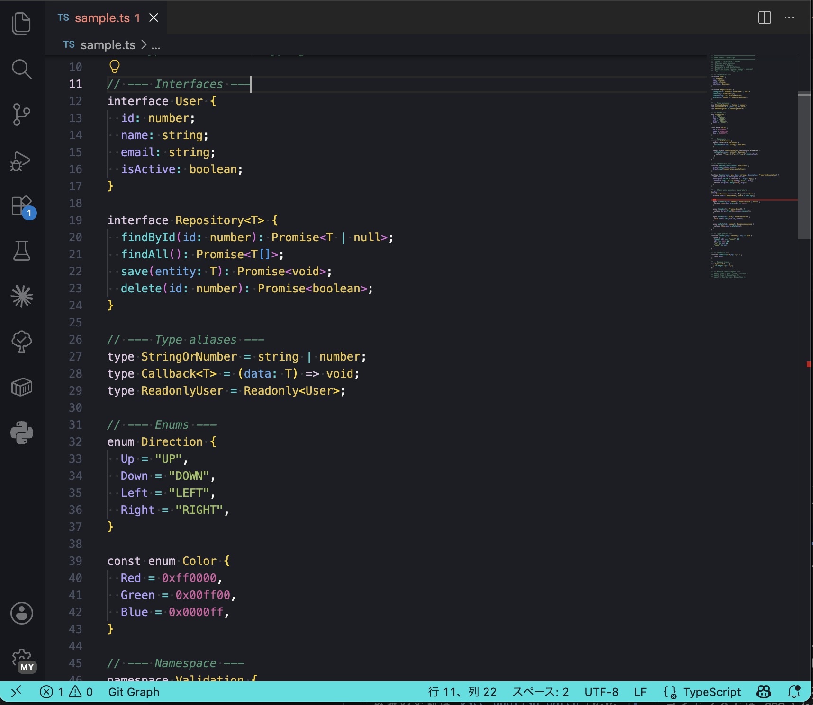

# Sapphire Moonlight

An accessible, high-contrast dark theme for VS Code — tuned for readability and reduced eye strain. Signature sapphire cyan for functions and golden-yellow for types, with WCAG AA+ contrast and color-blind-aware, low-halation syntax colors.

## Why this theme

- **High contrast, easy on the eyes** — body text sits at ~15:1 against the background, and every syntax color clears WCAG AA (most are AAA), while saturation is deliberately kept moderate to avoid the "vibrating" glare that vivid colors cause on dark backgrounds.
- **Color-blind aware** — syntax roles were checked under protanopia / deuteranopia / tritanopia simulation so that adjacent token types stay distinguishable, not just by hue but by lightness.
- **Non-color cues** — comments are *italic*, headings and bold are **bold**, strikethrough is rendered with a line — so meaning does not rely on color alone.

## Color palette

| Token | Color |
|-------|-------|
| Functions | `#3ed4d4` sapphire cyan (status bar keeps vivid `#00e0e0`) |
| Types / Classes | `#e8c44e` muted gold |
| Comments | `#4c9474` italic (subdued green) |
| Keywords | `#dcc6e0` lavender |
| Variables | `#b09ffa` soft purple |
| Strings / Operators | `#9fc15e` muted lime |
| Parameters | `#5fa8e8` sky blue |
| Numbers / Literals | `#cf609f` rose |
| Accents (`this`/`self`, regex, blockquote) | `#ffa07a` salmon |
| Background | `#1b1e23` |
| Foreground | `#f8f8f2` |

## Install

1. Open the Extensions view in VS Code (`Cmd+Shift+X` / `Ctrl+Shift+X`).
2. Search for **Sapphire Moonlight**.
3. Install, then pick it via **Preferences: Color Theme** (`Cmd+K Cmd+T` / `Ctrl+K Ctrl+T`) → **Sapphire Moonlight**.

> Building from source? Clone the repo and press `F5` to launch an Extension Development Host with the theme applied and the sample files loaded.

## Preview

Sample files for every supported language live in [`test-samples/`](test-samples/) (JS, TS, Python, Go, Ruby, PHP, CSS, HTML, JSON, Markdown, YAML, Shell, Rust, SQL) — handy for seeing the theme in action.

## License

See [LICENSE](LICENSE) if present, otherwise all rights reserved by the author.

**Enjoy!** 🌙
